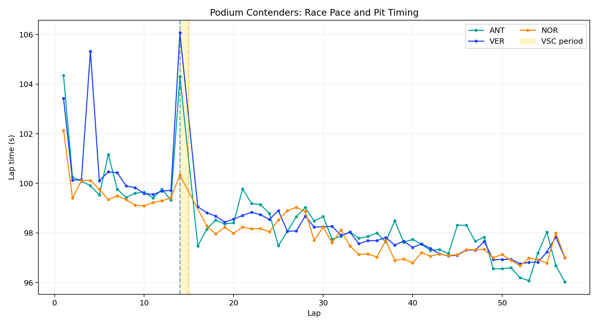
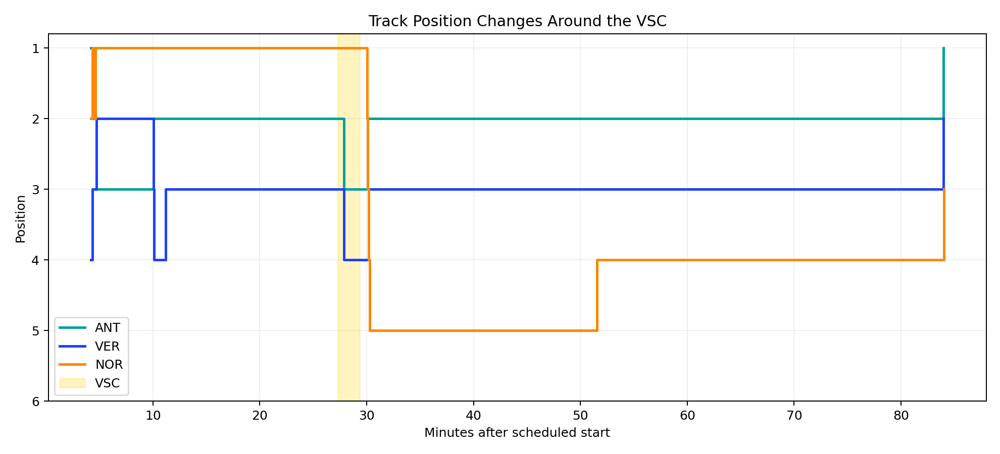
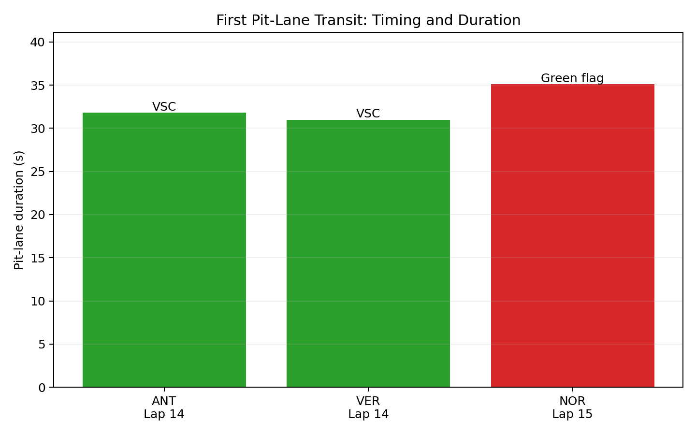

# 2026 Madrid Grand Prix Strategy Analysis

An engineering-focused analysis of the inaugural Madrid Formula 1 race. The project investigates how tire behavior, pit timing, and a lap-14 Virtual Safety Car changed the fight for victory.

## Race Strategy Question

**How did the VSC and first pit-stop sequence affect the podium, and what should a race-strategy system prioritize in a similar situation?**

## Project highlights

- Processes 1,105 usable lap records plus tire-stint, pit-stop, position, weather, race-control, and result data.
- Reconstructs the decisive VSC and pit sequence for Kimi Antonelli, Max Verstappen, and Lando Norris.
- Uses robust regression to measure each podium driver's net hard-tire pace trend.
- Compares Ridge and Random Forest lap-time models with grouped cross-validation that holds out entire drivers.
- Produces decision-focused charts and a concise engineering recommendation.
- Separates observed association from causal claims and documents important data limitations.

## Key findings

- The VSC was deployed on lap 14 and lasted 123 seconds.
- Antonelli and Verstappen stopped during the VSC; Norris stopped on lap 15 after it ended.
- Norris's recorded pit-lane transit was 3.3 seconds longer than Antonelli's.
- Position data shows Norris dropping to fifth during the sequence before recovering to third.
- Antonelli won by 4.351 seconds over Verstappen and 5.089 seconds over Norris.
- Net hard-tire lap times improved across the stint because fuel burn outweighed the combined effect of tire degradation, traffic, and other variation. The trend is therefore not presented as a pure tire-wear estimate.
- Random Forest achieved the lowest held-out-driver lap-time error at 1.397 seconds MAE, narrowly ahead of Ridge at 1.427 seconds.

## Engineering recommendation

At a circuit with limited passing opportunities, track position should receive high strategic weight. When a VSC occurs near the expected pit window, the decision system should immediately compare reduced pit loss, pit-exit traffic, tire state, and stop-time uncertainty. In this race, the available evidence supports pitting during the VSC when operationally possible.

## Visual outputs







- `strategy_timeline.png`: lap pace, pit laps, and VSC timing
- `position_changes.png`: track-position changes around the VSC
- `pit_stop_comparison.png`: pit timing and recorded pit-lane duration
- `hard_tire_net_pace_trend.png`: robust net pace trends
- `model_comparison.png`: held-out-driver model error
- `analysis_summary.md`: decision summary and limitations

## Run locally

```bash
python -m venv .venv
source .venv/bin/activate
pip install -r requirements.txt
python fetch_data.py
python analyze_race.py
python -m unittest discover -s tests
```

Processed results and charts are included for immediate review. Raw API responses are generated locally with `fetch_data.py` and excluded from version control to keep the repository lightweight.

## Data source and use

Data comes from the community-operated [OpenF1 API](https://openf1.org/), which provides historical Formula 1 timing and telemetry for educational and personal projects. OpenF1 is not affiliated with Formula 1. This repository is a non-commercial educational portfolio analysis.

## Limitations

This project analyzes one race. Public timing data does not directly provide fuel load, car setup, exact tire condition, or every operational constraint. Results support a strategy interpretation, not a claim that an alternative action would have guaranteed a different winner.

## AI assistance

Used AI tooling to accelerate development while independently designing the cross-validation methodology, debugging the data pipeline, and validating and interpreting all results.
